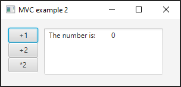

# MVC-examples

**MVCexample1:** a simple example 3 buttons and a TextArea. How to bind an "integer" (SimpleIntegerProperty) with a TextArea and change its value by pressing on the buttons.

**MVCexample2:** Again: 3 buttons and a TextArea. 
- Now bind a string "The number is:   " + SimpleIntegerProperty to the TextArea
- Use 2 different FXML files and 2 controllers. One FXML contains only the buttons, and the other only the TextArea.

